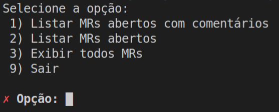

# Git Lab Tool

- Simple tool to list user's merge requests using gitlab api:
> GET /merge_requests

### Compiling and Running
- Download and configure the latest version of GO [compiler](https://golang.org/dl/)
- Build (on mac and linux):   
> make    
- Edit file bin/.env or export the following variables: 
> gitlab_access_token   
> gitlab_url_api   
- Execute: 
> ./bin/gitlabtool   
